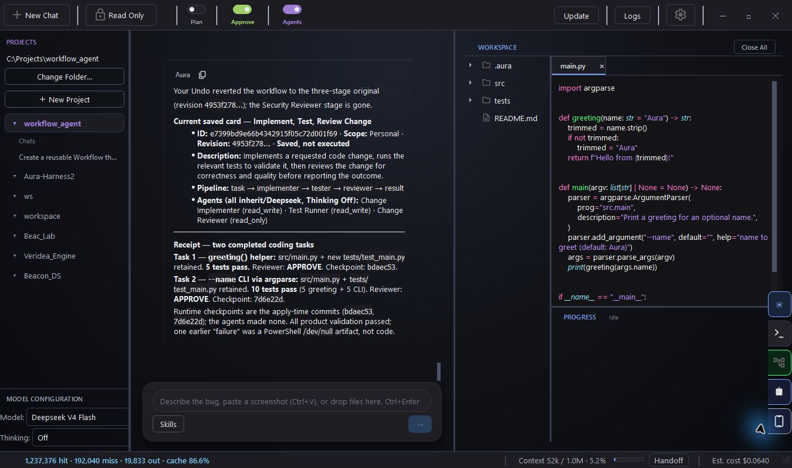
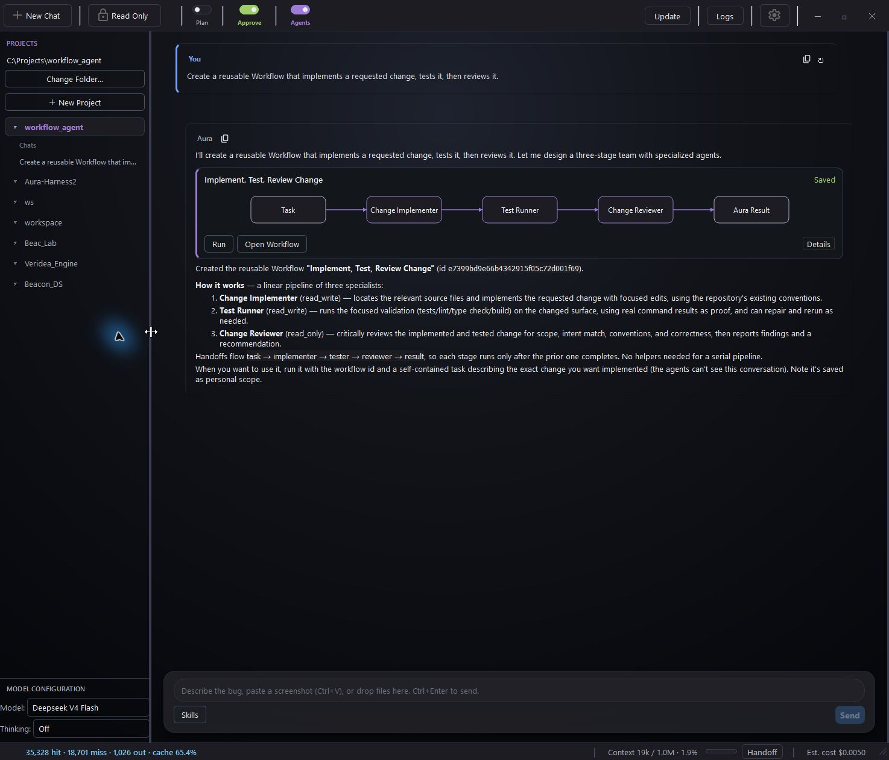
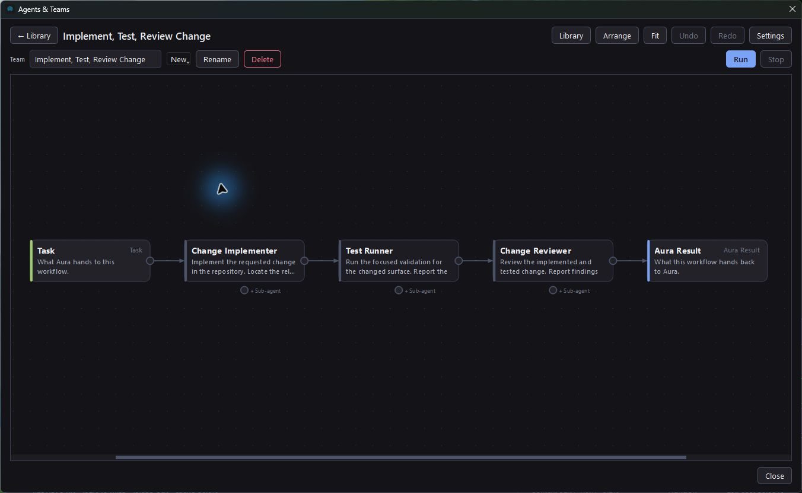

# Aura IDE

**Code with AI. Work your way.**

Aura is an open-source desktop app for coding with AI. Open a project, choose a hosted or local model, and describe the work. Aura can handle the task directly or bring in Agents with their own instructions, models, and permissions.

When you find a process that works, keep it as a reusable Team. Create and refine it through conversation, see how it fits together on a graph, and run it again with a different task.

[**Download for Windows**](https://github.com/CarpseDeam/Aura-IDE/releases/latest) · [Take the tour](https://carpsedeam.github.io/Aura-IDE/) · [Documentation](docs/README.md) · [Discord](https://discord.gg/aGSthBX2Bg)

*Your conversation, project files, code, and results in one workspace. Click any screenshot to see it at full size.*

## Get started

**Windows:** Download and run the latest `.exe` from [Releases](https://github.com/CarpseDeam/Aura-IDE/releases/latest). Python is bundled, installation is per user, and updates are available inside Aura.

**macOS and Linux:** Run from source with Python 3.10+. See the [installation guide](docs/getting-started.md#install).

1. Open a project folder.
2. Connect your model: add a hosted API key in **Settings → API Keys**, or connect a running local server in **Settings → Models**.
3. Ask for a small change: **“Find a function that needs a test, add one, run it, and explain the result.”**
4. Review the changes and check the reported validation results.

Aura is free under the MIT license. Hosted providers charge separately for API usage. Local models need a running server such as Ollama, LM Studio, or llama.cpp; Aura connects to it and discovers its models.

[First-run walkthrough →](docs/getting-started.md)

## Make a team by describing the work

Turn on **Agents** to let Aura assemble a team or use a saved Team during chat. You can save an individual Agent or keep an assembled team for later.

To create a reusable process explicitly, ask:

> Create a reusable workflow that implements a requested change, tests it, then reviews it.

Creating the workflow saves the process without executing it. Inspect the graph card, ask for changes such as **“Add a security review,”** or undo an edit. Click **Run** and supply a task when you want to use it.

An **Agent** is a reusable helper. A **Team** is a saved workflow that connects Agents and gives each one an assignment. Agents can inherit your current model or use another configured hosted or local model.

Use the searchable **Agents & Teams** library to find your helpers and processes. Open a Team to arrange the graph, edit assignments, or add branches and helpers. Saved workflows and their chat cards remain available across restarts.

The team shown here was used for two tasks in a small Python project: a greeting helper, then a `--name` command-line option. The second run finished with 10 passing tests and the changes retained in the project. [See the completed run](media/workflow-conversation-result.png).

[Agents and Teams guide →](docs/agents-and-teams.md)

## Choose your models

| Connection | Options |
| --- | --- |
| Hosted APIs | DeepSeek, OpenAI, Anthropic, Gemini, OpenRouter |
| Local servers | Ollama, LM Studio, llama.cpp, and compatible OpenAI-style servers |
| Per-Agent choices | Inherit Aura's model, or choose a configured model and thinking level for each Agent |

Local coding requires a model/server with tool-calling support and enough context for the task. You can mix hosted and local models in the same Team.

[Model setup →](docs/providers.md)

## Keep the work understandable

- **Project context:** Aura reads and searches your repository, follows references, and works with your project's tools.
- **Review controls:** Inspect proposed diffs before writes when manual approval is enabled. Read Only and Plan review provide additional control.
- **Visible progress:** Follow tool activity, terminal output, checks, and the final report, including failures.
- **Agent changes:** Writable Agent work uses isolated worktrees. Review and apply the retained changes through Aura.
- **Workspace controls:** Hide and reopen the workspace pane while keeping your files and conversation.
- **More tools:** Connect MCP servers or use Git and terminal tools from the same app.

[Safety and control →](docs/safety.md) · [Tool reference →](docs/tools.md)

## Take the conversation with you

Aura Companion lets you browse projects, send messages, and follow work from your phone. Pair it with the desktop through a local or hosted relay. Your desktop keeps running the project and must stay on.

[Companion setup →](docs/mobile.md)

## Help shape Aura

Aura is developed using Aura. Reports from real projects help improve the app: what you tried, what happened, and where you got stuck.

[Report a bug](https://github.com/CarpseDeam/Aura-IDE/issues) · [Join Discord](https://discord.gg/aGSthBX2Bg) · [Read the build log](https://aura-ide.hashnode.dev/)

Support continued development through [GitHub Sponsors](https://github.com/sponsors/CarpseDeam) or [Buy Me a Coffee](https://buymeacoffee.com/snowballkori).

[MIT License](LICENSE)
