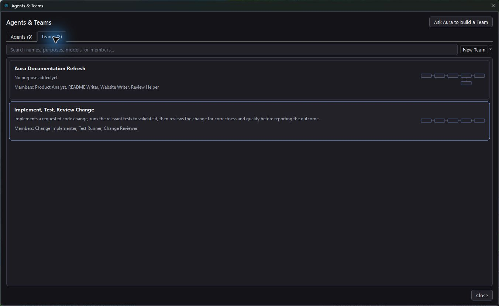

# Agents and Teams

An **Agent** is a reusable helper with instructions, a model choice, a thinking level, and Read only or Read / Write permission.

A **Team** is a saved workflow that connects Agents and assigns each one a piece of the work. The library calls saved workflows Teams; chat cards may use the word Workflow.

## Let Aura build a team as you work

With **Agents on**, Aura can assemble a temporary team or use a runnable saved workflow during a normal conversation. Cards in chat show the delegated work and its progress.

Use **Save Agent** to keep an individual helper or **Keep Team** to retain the process for future work. Automatic teams are bounded to six Agent occurrences, including helpers.

Aura continues to own the conversation and final response. You can also work directly with Aura without creating a Team first.

## Create a reusable Team through conversation

1. Open your project, configure a model, and turn **Agents on** for the walkthrough.
2. Ask: **“Create a reusable workflow that implements a requested change, tests it, then reviews it.”**
3. Inspect the saved graph card. **Details** shows assignments, models, thinking settings, and permissions.
4. Refine it: **“Add a security review before the final result.”** Aura edits the same workflow. **Undo** reverses its latest edit.
5. Click **Run** and enter a task. Use the same card again with another task to reuse the process.

Creation saves the process without running it. Agents inherit Aura's current model by default. Changing an assignment in a workflow does not rewrite the shared Agent's instructions.

Read Only prevents authoring changes, and Plan review applies when enabled. Authoring is also available when Agents is off; the switch controls automatic delegation during ordinary chat.

## Organize your library

Open **Agents & Teams** from the right rail. Browse the **Agents** and **Teams** tabs or search by name, purpose, model, or member.

Use **New Agent** or **New Team** to create one manually, or choose **Ask Aura to build a Team** to start from conversation.

The creation menu offers storage in the current project or for this computer. Both appear in the same library. Separate definitions can share a name; storage and identity details remain available in tooltips and settings.

## Edit a Team on the canvas

Open a Team from the library or choose **Open Workflow** on its chat card.

- **Library** opens the reusable Agent library beside the canvas.
- **Settings** opens the inspector. Selecting an Agent occurrence shows its assignment and settings.
- **Arrange** lays out the graph compactly. You can also move nodes yourself.
- **Fit** brings the graph into view.
- **Undo / Redo** restore edits, including arrangement changes. Chat and canvas use the same session undo history.

Editing a reusable Agent's settings affects its uses in other workflows. An occurrence's assignment belongs to that placement in the Team.

## Read the connections

**Solid arrows** define the execution order from Task through Agent steps to Aura Result. A step that needs another step's output or changes must follow it.

Branches and joins are supported. Independent read-only steps may run concurrently. A join waits for every predecessor to succeed. Writable steps run exclusively, including steps with writable helpers, so readers and writers do not overlap.

**Dashed connections** attach optional Sub-agents. A step can invoke its directly attached helpers; those helpers can have their own attached helpers. Dashed helpers do not become automatic steps in the solid path.

Local model requests are serialized to share the local inference server. Hosted branches can still run concurrently when their permissions and dependencies allow it.

## Run, review, and return

A card's **Run** requests that exact saved workflow for a fresh task. Opening another Team in the editor does not change that choice. The explicit Run action works independently of the Agents switch.

Follow the progress card and use **Stop** to cancel an active run. Writable Agent work takes place in isolated worktrees; inspect and apply the retained changes through Aura's result handling.

Saved workflows and their chat cards survive restarting Aura. Reopened cards show the current saved workflow. Undo history belongs to the current session, so restarting does not restore earlier undo steps.

[Model setup](providers.md) · [Review controls](safety.md) · [Back to documentation](README.md)
